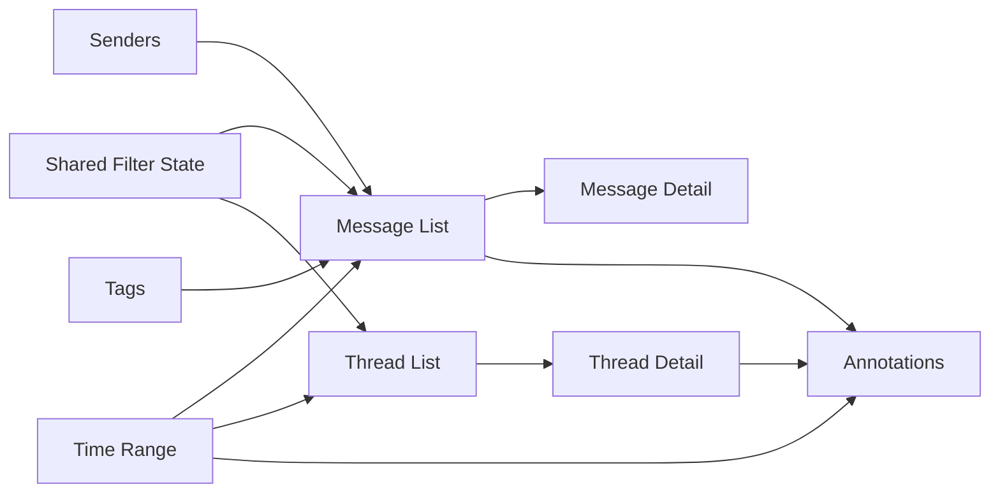

# Traditional Inbox Browsing, Reusable Views, and Time-based Exploration

## 1. Problem Statement

The current sqlite UI is annotation-first. That is useful for reviewing tags and agent runs, but it is not yet a comfortable exploration tool for the underlying mailbox data. A reviewer often needs to answer questions that sound like email-client questions:

- show me all messages from this sender
- show me the thread around this message
- search mail by subject/body/sender
- view everything in a certain time range
- filter to messages with a certain annotation tag

Those questions are natural, and the database already contains most of the raw data needed to answer them. The missing layer is a coherent browsing model across backend and frontend.

## 2. Existing System Overview

## 2.1 Mirror data

The mirror schema is in `/home/manuel/code/wesen/corporate-headquarters/smailnail/pkg/mirror/schema.go`.

Important fields in `messages`:

- `account_key`
- `mailbox_name`
- `uidvalidity`
- `uid`
- `message_id`
- `internal_date`
- `sent_date`
- `subject`
- `from_summary`
- `to_summary`
- `cc_summary`
- `body_text`
- `body_html`
- `search_text`
- `has_attachments`
- `remote_deleted`

Also important:

- `messages_fts` exists for FTS5-backed searching

This means the database already behaves much more like a mail store than the current UI suggests.

## 2.2 Enrichment data

The enrichment schema is in `/home/manuel/code/wesen/corporate-headquarters/smailnail/pkg/enrich/schema.go`.

Important additions:

- `messages.thread_id`
- `messages.thread_depth`
- `messages.sender_email`
- `messages.sender_domain`
- `threads` table
- `senders` table

Thread reconstruction is implemented in `/home/manuel/code/wesen/corporate-headquarters/smailnail/pkg/enrich/threads.go`.

So the system already knows:

- who sent a message
- which thread a message belongs to
- rough thread summaries

## 2.3 Current UI surface

Relevant pages:

- `/home/manuel/code/wesen/corporate-headquarters/smailnail/ui/src/pages/SendersPage.tsx`
- `/home/manuel/code/wesen/corporate-headquarters/smailnail/ui/src/pages/SenderDetailPage.tsx`

The sender detail page already proves a useful pattern:

- fetch sender summary
- fetch related annotations
- fetch related logs
- fetch recent messages

That pattern should be generalized into reusable message/thread browser primitives instead of remaining sender-only.

## 3. Product Intent

The goal is not to clone a full email client with compose, reply, and folders. The goal is to make the sqlite analysis UI support the core browsing and filtering workflows that analysts and reviewers need.

Success looks like this:

- the user can navigate messages, threads, senders, tags, and time ranges naturally
- the same browsing widgets can appear in multiple contexts
- message and annotation exploration feel like one connected system

This is about reusable exploration affordances, not polished screen art.

## 4. UX Intents And Affordances

## 4.1 Reusable views, not one-off pages

The user explicitly asked for views that can be embedded in different locations. That means implementation should think in terms of reusable panels or widgets, not only route-level screens.

Examples:

- "all messages for sender X"
- "all messages with tag Y"
- "all messages in mailbox Z during last 7 days"
- "all annotations and messages during a selected time period"

These should share a common query/filter model.

## 4.2 The user should always know what slice they are looking at

Because the same view may be embedded in different places, the UI must make the active slice obvious.

Examples of context that should always be visible:

- sender filter
- mailbox filter
- tag filter
- thread filter
- time range
- search query

This is a UX requirement, not just a backend concern.

## 4.3 Search should work at multiple levels

The user asked for:

- sender searching/filtering
- message/thread browsing
- time period views

That implies at least three search modes:

- sender search
- message search
- thread search

These modes can share infrastructure, but they should not be forced into one flat result list if that hurts usability.

## 5. Conceptual Model

The system should expose four reusable primitives:

- message list
- message detail
- thread list
- thread detail

Around those, it should expose reusable filter state:

- sender
- domain
- mailbox
- tag
- annotation state
- time range
- free-text query

### Diagram



## 6. Backend Design

## 6.1 Suggested endpoints

The current sqlite server in `/home/manuel/code/wesen/corporate-headquarters/smailnail/pkg/annotationui/server.go` should grow a message/thread browsing API surface.

Recommended endpoints:

- `GET /api/mirror/messages`
- `GET /api/mirror/messages/{messageKey}`
- `GET /api/mirror/threads`
- `GET /api/mirror/threads/{threadId}`
- `GET /api/mirror/senders`
- `GET /api/mirror/senders/{email}`
- `GET /api/mirror/timeline`

Possible supporting endpoints later:

- `GET /api/mirror/tags`
- `GET /api/mirror/mailboxes`

## 6.2 Filter contract

A shared query model should support:

- `q`
- `mailbox`
- `sender`
- `domain`
- `tag`
- `reviewState`
- `from`
- `to`
- `hasAttachments`
- `remoteDeleted`
- `limit`
- `cursor` or `offset`

Do not implement a different ad hoc filter vocabulary for each endpoint unless there is a strong reason.

## 6.3 Message identifier strategy

A new engineer needs to think carefully here.

The underlying message uniqueness in sqlite is:

- `account_key`
- `mailbox_name`
- `uidvalidity`
- `uid`

This composite key is correct but awkward at the API layer.

You have two reasonable options:

### Option A: expose a synthetic API key

Example:

```text
acct123|INBOX|777|4812
```

Pros:

- easy routing
- easy frontend links

Cons:

- needs careful escaping/encoding

### Option B: keep composite key fields in routes/query params

Pros:

- transparent

Cons:

- clumsy routes

Recommendation: use a synthetic opaque message key in the API layer and decode it server-side.

## 6.4 Thread list query

Use the enriched `threads` table plus annotation joins.

Example SQL sketch:

```sql
SELECT
    t.thread_id,
    t.subject,
    t.mailbox_name,
    t.message_count,
    t.participant_count,
    t.first_sent_date,
    t.last_sent_date,
    COUNT(DISTINCT a.id) AS annotation_count
FROM threads t
LEFT JOIN annotations a
    ON a.target_type = 'thread'
   AND a.target_id = t.thread_id
WHERE 1 = 1
  AND (? = '' OR t.mailbox_name = ?)
  AND (? = '' OR t.subject LIKE '%' || ? || '%')
  AND (? = '' OR t.last_sent_date >= ?)
  AND (? = '' OR t.last_sent_date <= ?)
GROUP BY t.thread_id
ORDER BY t.last_sent_date DESC
LIMIT ?
```

## 6.5 Message list query

This should support both plain filtering and FTS-backed text search.

Implementation rule:

- if `q` is empty, query `messages` directly
- if `q` is non-empty and FTS is available, join against `messages_fts`

Pseudocode:

```go
if q == "" {
    queryMessagesByFilters(...)
} else {
    queryMessagesByFTSAndFilters(...)
}
```

The important point is that full-text search and structured filters must combine cleanly.

## 6.6 Timeline endpoint

The user asked to view annotations and emails by time period. A timeline endpoint can support that without requiring every screen to invent its own aggregation query.

Suggested output:

```json
{
  "bucketSize": "day",
  "buckets": [
    {
      "start": "2026-04-01",
      "messageCount": 123,
      "annotatedMessageCount": 18,
      "annotationCount": 24
    }
  ]
}
```

This can power:

- a global time filter bar
- sender-specific activity views
- tag-specific activity views

## 7. Frontend Design

## 7.1 Shared filter model

Create a shared filter object rather than page-specific loose params.

Example:

```ts
type InboxSliceFilter = {
  q?: string;
  mailbox?: string;
  sender?: string;
  domain?: string;
  tag?: string;
  reviewState?: ReviewState;
  from?: string;
  to?: string;
  hasAttachments?: boolean;
};
```

This filter type should be reusable across:

- sender detail embedded message list
- tag detail message list
- standalone inbox browser
- time-range views

## 7.2 Reusable components

Build components with data/view reuse in mind.

Recommended components:

- `MessageList`
- `MessageDetail`
- `ThreadList`
- `ThreadDetail`
- `InboxFilterBar`
- `TimeRangeSummary`

Do not lock them to a single route.

## 7.3 Context examples

The same `MessageList` should work for:

- all messages
- all messages from a sender
- all messages with an annotation tag
- all messages in a thread
- all messages in a mailbox during a time period

That means the component should receive:

- filter state
- fetch hook / query args
- optional context label

## 7.4 Sender search and filtering

The current senders page only lists senders and optional annotation/domain filters at the API layer.

It should gain:

- free-text search on email and display name
- domain filter
- mailbox filter where meaningful
- time range filter
- sort options such as recent activity or message volume

The user explicitly said there are many senders. That means sender navigation quality is a core requirement, not a nice-to-have.

## 7.5 Time period exploration

Time filters should feel like a system capability, not one isolated widget.

Useful presets:

- today
- last 7 days
- last 30 days
- custom range

Useful scopes:

- all messages
- messages for sender
- messages for tag
- annotations and messages together

## 8. Annotation Integration

This ticket is not separate from annotation review. It is complementary.

Examples of useful integrations:

- thread rows show annotation counts
- message detail shows related annotations
- sender detail offers "browse all messages"
- tag view offers "browse all tagged messages"
- timeline view can overlay message counts and annotation counts

That is how the product becomes one coherent analysis environment instead of two disconnected tools.

## 9. Suggested API Response Shapes

## 9.1 Message row

```json
{
  "messageKey": "acct123|INBOX|777|4812",
  "mailboxName": "INBOX",
  "uid": 4812,
  "sentDate": "2026-04-02T09:10:00Z",
  "subject": "Your receipt",
  "fromSummary": "Store <receipts@store.example>",
  "senderEmail": "receipts@store.example",
  "threadId": "<root@example.com>",
  "hasAttachments": false,
  "annotationCount": 1,
  "tags": ["receipt"]
}
```

## 9.2 Thread row

```json
{
  "threadId": "<root@example.com>",
  "mailboxName": "INBOX",
  "subject": "Quarterly planning",
  "messageCount": 7,
  "participantCount": 4,
  "firstSentDate": "2026-03-30T12:00:00Z",
  "lastSentDate": "2026-04-02T16:00:00Z",
  "annotationCount": 2
}
```

## 9.3 Message detail

Include:

- headers summary
- body preview
- related annotations
- neighboring thread context

Avoid returning raw RFC822 bodies as the default message detail payload unless there is a specific need.

## 10. Suggested Implementation Sequence

### Step 1: backend message/thread query layer

- define DTOs
- define filter parsing helpers
- implement list/detail handlers
- test search and filters

### Step 2: frontend shared types and hooks

- create new TypeScript types
- create RTK Query endpoints
- create reusable filter model

### Step 3: reusable components

- build list/detail primitives for messages and threads
- keep them context-agnostic

### Step 4: route-level pages

- standalone messages page
- standalone threads page
- sender detail integration
- tag/time-based embedded uses

### Step 5: time exploration

- add timeline endpoint
- add shared time filter controls
- connect messages and annotations to the same time slice

## 11. Pseudocode For A Reusable Embedded View

```tsx
function SenderMessagesPanel({ senderEmail }: { senderEmail: string }) {
  const filter = useInboxFilter({ sender: senderEmail, limit: 50 });
  const { data, isLoading } = useListMessagesQuery(filter);

  return (
    <MessageList
      contextLabel={`Messages from ${senderEmail}`}
      filter={filter}
      rows={data ?? []}
      isLoading={isLoading}
    />
  );
}
```

The same `MessageList` can be reused elsewhere with different initial filters.

## 12. Risks And Boundaries

### 12.1 Accidentally building a mail client

This ticket is not about:

- sending mail
- replying
- mailbox management
- flag editing

It is about browsing and analysis.

### 12.2 Route-specific duplication

If every page fetches messages differently, the system will quickly become inconsistent. Invest in shared DTOs, shared filters, and shared list/detail primitives.

### 12.3 Overcomplicated pagination

Start simple. If the first iteration can use `limit` plus stable sorting, that is fine. Cursor pagination can come later if needed.

## 13. Acceptance Criteria

This ticket should be considered functionally complete when:

- the user can browse messages directly
- the user can browse threads directly
- sender search/filtering is materially better than the current flat table
- message and thread views can be embedded in multiple contexts
- the user can inspect messages and annotations by time period
- backend tests cover message/thread list and search behavior

## 14. First Files An Intern Should Open

Read these in order:

1. `/home/manuel/code/wesen/corporate-headquarters/smailnail/pkg/mirror/schema.go`
2. `/home/manuel/code/wesen/corporate-headquarters/smailnail/pkg/enrich/schema.go`
3. `/home/manuel/code/wesen/corporate-headquarters/smailnail/pkg/enrich/threads.go`
4. `/home/manuel/code/wesen/corporate-headquarters/smailnail/pkg/annotationui/handlers_senders.go`
5. `/home/manuel/code/wesen/corporate-headquarters/smailnail/ui/src/pages/SendersPage.tsx`
6. `/home/manuel/code/wesen/corporate-headquarters/smailnail/ui/src/pages/SenderDetailPage.tsx`
7. `/home/manuel/code/wesen/corporate-headquarters/smailnail/ui/src/types/annotations.ts`

Those files explain the current state of the data and the existing UI patterns this ticket should extend.
