# Email Triage: AI Secretary for a 33K Message Inbox

What happens when you point a coding agent at two years of someone's email and ask it to be their secretary? This project is the answer: a systematic triage of a 33,000-message inbox using a SQLite mirror database, a CLI annotation system, and a progressive approach that starts with exploration, moves through sender categorization, and ends with a design for selective embedding and RAG — all for under a dollar.

> [!summary]
> This project has three deliverables:
> 1. A complete sender-level triage of a 33K message inbox (446 annotations, 5 review groups, 21 tag categories)
> 2. A design for selective embedding/RAG that's 200x cheaper than naive embedding
> 3. A handbook for future agents doing annotation work, emphasizing granular logging

## The starting point

The raw material is a SQLite database containing a two-year IMAP mirror of a single inbox. The tool `smailnail` had already done the heavy lifting of fetching, storing, and enriching the data — thread reconstruction, sender normalization, unsubscribe link extraction. What didn't exist was any judgment about which of those 33,000 messages mattered.

The database is 5.3GB on disk, mostly because every message body (text and HTML) is stored inline. There are 1,305 unique sender domains, 2,187 unique sender emails, and 29,305 reconstructed threads — but 28,405 of those threads are single-message (newsletters, notifications, one-offs).

The annotation system was already built into `smailnail`: tables for annotations, groups, and logs with a generic `(target_type, target_id)` scheme that can annotate senders, domains, messages, threads, or accounts. The CLI commands existed. The tables were empty.

## What the inbox looks like

The first surprise was the sheer volume of noise. Nearly half the inbox — 48% — turned out to be automated notifications, marketing, and spam.

The dominant sender is GitHub notifications at almost 9,000 messages, and within those, CI failure alerts alone account for 4,000 messages (12% of the entire inbox). The second-largest category is newsletters: about 30 active Substack subscriptions, plus beehiiv, readwise, and various independent newsletters, totaling around 4,600 messages.

Personal email from real humans — the most valuable slice — is just 363 messages. About 1% of the inbox. It's buried under layers of TechCrunch Daily and DoorDash promotions.

The breakdown, roughly:

| Category | Messages | Share |
|---|---|---|
| GitHub CI + notifications | 9,153 | 28% |
| Newsletters | 4,644 | 14% |
| Marketing + spam | 2,914 | 9% |
| Social notifications | 2,103 | 6% |
| Transactional | 1,661 | 5% |
| Services | 1,341 | 4% |
| Community | 646 | 2% |
| Work | 636 | 2% |
| Hobby/creative | 519 | 2% |
| **Personal** | **363** | **1%** |
| Important (tax, legal, equity) | 471 | 1% |
| Uncategorized (low-volume) | 8,767 | 27% |

## The triage process

### Phase 1: Sender categorization

The approach was simple: classify senders, not messages. A sender classified once propagates to all their messages. This turned a 33,000-message problem into a 2,187-sender problem, and most of those senders only needed domain-level heuristics.

The work progressed in waves:

**Wave 1 — Noise senders.** Start with the obvious: GitHub CI notifications, spam domains (the kind that send from `accounting@costsoldier.com` and `netsuite@voip-prices.com`), marketing blasts from retail stores, social platform notifications from Facebook, LinkedIn, Twitch, Nextdoor.

Six spam domains alone contained 95 individual sender addresses — they rotate sender names on the same domain to evade filters. Tagging the domain-level annotation covered all of them.

**Wave 2 — Newsletters.** Substack senders are easy to identify by domain. The harder part is subcategorization: is `garymarcus@substack.com` tech, culture, or AI criticism? The initial pass was too coarse — many culture and philosophy newsletters got lumped into `newsletter/tech`. A known flaw documented for the reviewer.

**Wave 3 — Personal contacts.** Gmail, iCloud, Yahoo, and Hotmail senders with 2+ messages were tagged as personal. This is an imperfect heuristic — some are strangers from community forums — but it catches the important correspondents: family, friends, recurring discussion partners.

**Wave 4 — The important senders you almost miss.** This was the most interesting phase. The volume-based approach completely missed senders that are low-volume but high-consequence: a CPA who sent 11 messages about tax filing (including a past-due invoice), a lawyer handling a separation agreement (19 messages), equity platforms asking about stock option holdings, rent autopay confirmations, health service providers.

These are exactly the emails a human secretary would flag first. They got a second layer of `important/*` tags on top of their base categories, so a sender can be both `personal` and `important/legal`.

### Phase 2: Review groups

Five groups were created for batch review:

- **Unsubscribe Candidates** (86 senders) — noise senders that have `List-Unsubscribe` headers, meaning they can actually be unsubscribed from
- **Valuable Newsletters** (99 senders) — newsletters tagged as worth reading
- **Personal Contacts** (52 senders) — real humans
- **Work Senders** (8 senders) — employer-related
- **Hobby & Creative** (25 senders) — music production, photography, gaming, 3D printing, fitness

### Phase 3: Surfacing actionable items

With senders categorized, the interesting queries become possible: "show me personal emails from the last 90 days that might need a reply," "what did my CPA say recently?", "any conference invitations I missed?"

The surfacing revealed active conversations about programming language theory (method dispatch and multiple dispatch), ongoing alumni group threads, a Zettelkasten course offer, and financial items needing attention.

## The slow query problem

An interesting technical detour: joining `messages` to `annotations` on `sender_email` takes 5 minutes because there's no index on `messages.sender_email`. The table is 5.3GB and SQLite has to scan every row, touching all that body text data even when the query only needs the sender email.

The workaround is to pre-aggregate with a CTE:

```sql
-- This times out (5+ minutes):
SELECT a.tag, COUNT(m.id) FROM messages m
JOIN annotations a ON a.target_id = m.sender_email ...

-- This runs in 0.7 seconds:
WITH sender_counts AS (
  SELECT sender_email, COUNT(*) as cnt
  FROM messages GROUP BY sender_email
)
SELECT a.tag, SUM(sc.cnt)
FROM annotations a
JOIN sender_counts sc ON sc.sender_email = a.target_id ...
```

The CTE approach forces SQLite to do one sequential scan of messages (grouping by sender_email into a temporary table), then joins the small result (~2,187 rows) to the small annotations table (~446 rows). The proper fix is `CREATE INDEX idx_messages_sender_email ON messages(sender_email)` but the workaround proved the principle without modifying the database.

## Implementation details

### The annotation data model

The annotation system uses a generic target model where everything is `(target_type, target_id)`:

```
annotations     — one tag + note per target, with review_state
target_groups   — named collection of targets
target_group_members — (group_id, target_type, target_id)
annotation_logs — timestamped log entries (reasoning, decisions, summaries)
annotation_log_targets — links logs to the targets they describe
```

The key design choice is that annotations are additive: a sender can have multiple tags (`personal` + `important/legal`), each as its own row with its own review state. Nothing is overwritten.

### The tag taxonomy

```
noise/ci, noise/marketing, noise/spam, noise/social-notif, noise/transactional
newsletter/tech, newsletter/culture, newsletter/creative
personal, work, community, financial, services, hobby
important/tax, important/legal, important/equity, important/work-admin,
important/housing, important/health, important/conferences
```

The `important/*` namespace is the most interesting: it marks senders whose messages have real-world deadlines or financial/legal consequences, regardless of volume.

### Agent run traceability

Every annotation carries `source_label`, `agent_run_id`, and `created_by` fields. Annotation logs with `log_kind` values (`decision`, `reasoning`, `summary`, `note`) create a reviewable timeline. Each log is linked to the specific targets it describes via `annotation_log_targets`.

The ideal agent run produces a timeline like:

```mermaid
flowchart TD
    A["🟢 decision: Run started"] --> B["📝 note: 48% of inbox is noise"]
    B --> C["🔍 reasoning: news@tc.com → newsletter"]
    C --> D["🔍 reasoning: noreply@gh.com → notification"]
    D --> E["🔍 reasoning: dave@cpa.com → important/tax"]
    E --> F["📝 decision: Strategy change — adding importance tags"]
    F --> G["🔍 reasoning: lawyer@law.com → important/legal"]
    G --> H["📊 summary: Run complete — 23 senders classified"]
    
    style A fill:#2d5016
    style H fill:#1a3a5c
    style F fill:#5c4a1a
```



### The investigation trail

Every SQL query and shell script from the session was saved as a numbered file:

- `00-08` — action scripts that modify the database (categorization, group creation, surfacing)
- `09-52` — investigation queries that analyze the data (schema exploration, sender analysis, performance profiling, embedding budget estimation)

This creates a complete replay trail: a future agent (or human) can re-execute any step, understand why a decision was made, and extend the work.

## The selective embedding design

The most technically interesting part of the project is the embedding strategy. The naive approach — embed all 33,000 messages — would cost about $59 in embedding fees and produce a noisy index where newsletters drown out personal correspondence. The selective approach costs $0.75 total (embeddings + LLM transforms) and produces a better index.

### Five embedding layers

```mermaid
flowchart TD
    Q[User Query] --> L0
    L0["Layer 0: Script/Query Retrieval<br/>49 docs — find the right tool"] --> L1
    L1["Layer 1: Sender Profiles<br/>387 docs — who is this?"] --> L2
    L2["Layer 2: Thread Summaries + Newsletter Digests<br/>244 docs — what was discussed?"] --> L3
    L3["Layer 3: Subject Lines<br/>8,718 docs — find specific messages"] --> L4
    L4["Layer 4: Full Bodies (on-demand)<br/>834 docs — read the actual content"]
    L4 --> ANS[LLM Answer Generation]
    
    style L0 fill:#1a3a5c
    style L3 fill:#2d5016
    style L4 fill:#5c1a1a
```



**Layer 0** is the most novel: embed the SQL queries and scripts themselves with natural-language descriptions. When someone asks "who should I unsubscribe from?", the system retrieves the pre-built query that already answers this, runs it, and returns the result — no embedding search needed.

**Layer 1** uses LLM-generated sender profiles. Instead of embedding raw email addresses, generate a 200-word profile per sender: "Dave Miller CPA LLC — primary tax preparer, 11 messages about 2024 returns, stock option exercise questions, past-due invoice from Dec 2025."

**Layer 2** is where the biggest compression happens. A 15-message thread about equity and taxes contains 82,000 characters of raw body text (mostly quoted replies piling up). An LLM summary compresses this to ~200 words — a 400:1 ratio — while capturing the essential facts: who was involved, what was decided, what's still open.

**Layer 3** embeds subject lines directly. At ~112K tokens for all non-noise subjects, this is cheap and provides the broadest recall for "did I get an email about X?" queries.

**Layer 4** embeds full message bodies only for important and personal senders (~834 messages), after stripping quoted replies and signatures.

### Cross-encoder reranking

Cross-encoders score `(query, document)` pairs directly — more accurate than bi-encoders but too expensive for thousands of documents. They're used at three specific points:

1. **Tool selection** — pick the best script from Layer 0 candidates
2. **Subject reranking** — rerank top-50 subject lines to top-5 after bi-encoder recall
3. **Cluster validation** — detect redundant newsletter subscriptions by scoring `(digest_A, digest_B)` pairs

### LLM transformation before embedding

Six transform types prepare content for embedding:

| Transform | Input | Output | Ratio |
|---|---|---|---|
| Thread → Summary | Full thread | Structured summary | 400:1 |
| Newsletter → Digest | Last 20 subjects + snippets | Topic inventory | 100:1 |
| Sender → Profile | Metadata + subjects | Relationship context | N/A |
| Subject → Expanded | Terse subject | Enriched with context | 1:3 |
| Query → Description | SQL + comments | Natural language | N/A |
| Monthly → Digest | All signal msgs for month | Narrative summary | 50:1 |

Total LLM transform cost across all layers: ~1.1M tokens, roughly $0.48.

## The agent handbook

The final deliverable is a handbook for future agents: `pkg/doc/agent-annotation-handbook.md`, registered as a Glazed help page. It codifies the lessons from this session:

- Always generate and use an `agent_run_id`
- Create per-target `reasoning` logs, not just bookend `decision`/`summary` entries
- Link every log to its targets via `log link-target`
- Use `note` logs for investigation findings even when they don't produce annotations
- Use `decision` logs when changing strategy mid-run
- Save every query as a numbered script file
- Check for existing annotations before adding (idempotency)

The handbook exists so that the next triage run produces a clean, reviewable timeline instead of orphaned annotations with no explanation.

## What this project taught me

**The 1% that matters most is the hardest to find.** Personal email is 1% of volume but 100% of the emails a secretary would flag. Volume-based triage finds the noise efficiently but almost misses the CPA's past-due invoice and the lawyer's follow-up request.

**Sender classification is the right abstraction level.** Classifying 2,187 senders is tractable. Classifying 33,000 messages is not. And sender-level tags propagate perfectly — once you know `dave@cpa.com` is `important/tax`, every message from them is automatically important.

**Don't embed everything. Transform first, embed second.** Raw email bodies are terrible embedding targets: quoted replies, HTML boilerplate, email signatures, legalese footers. A 200-word LLM summary of a thread is a better embedding target than 82,000 characters of raw body text, and it's 400x cheaper to embed.

**Embed your tools, not just your data.** The most surprising insight was that embedding the SQL queries and scripts themselves creates a "tool retrieval" layer. Instead of searching for "tax emails" in an embedding index, the system can find and run the query that already answers this question. It's a form of compiled knowledge.

**Log your reasoning granularly.** The first pass left empty `agent_run_id` fields and unlinked log entries. The fix took a backfill script and a handbook to prevent recurrence. Future runs will produce a timeline where every classification decision is explained and linked to its target.

## Open questions

- Which embedding model to use: API-based (OpenAI, Voyage) vs local (nomic-embed-text)?
- Where to store embeddings: in the same SQLite DB (`sqlite-vec`) or a separate vector store?
- How to handle incremental updates when new mail arrives?
- Should newsletter digests be per-sender or cross-sender monthly topic clusters?
- How to handle the 1,523 messages with empty sender_email (all GitHub bot notifications)?

## Near-term next steps

- [ ] Implement Layer 3 (subject line embedding) as proof of concept
- [ ] Add `CREATE INDEX idx_messages_sender_email ON messages(sender_email)` to fix slow queries
- [ ] Run a fresh triage on the clean database copy following the handbook
- [ ] Build a retrieval pipeline prototype with bi-encoder + cross-encoder reranking
- [ ] Generate LLM sender profiles for the 387 annotated senders

## Project artifacts

| Artifact | Location |
|---|---|
| Mirror database | `~/smailnail/smailnail-last-24-months-merged.sqlite` |
| Clean copy (no annotations) | `~/smailnail/smailnail-last-24-months-clean.sqlite` |
| Docmgr ticket | `ttmp/2026/04/03/SMN-20260403-MAIL-TRIAGE--mail-analysis-and-triage-annotate-categorize-and-surface-actionable-items/` |
| Inbox summary report | `reference/02-inbox-summary-report.md` |
| Embedding/RAG design | `design/02-selective-embedding-and-rag-strategy-for-email-triage.md` |
| Agent handbook | `pkg/doc/agent-annotation-handbook.md` |
| Investigation scripts | `scripts/00-52` (9 action scripts + 43 SQL queries) |
