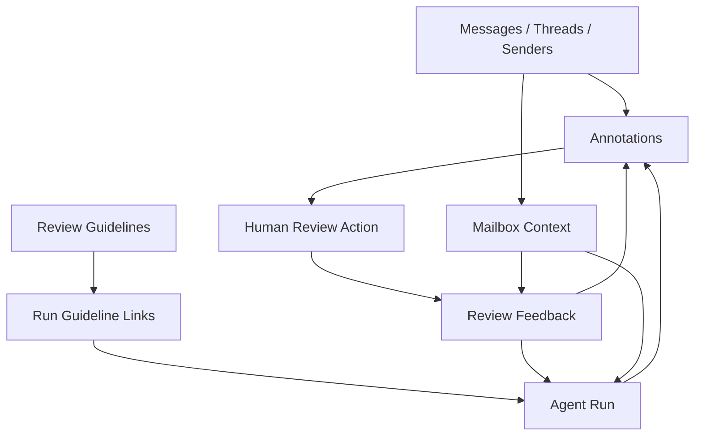

# Agent-run Review Requests, Guidelines, and Mailbox-aware Analysis

## 1. What This Ticket Is Actually About

The current sqlite annotation UI already supports browsing annotations, reviewing them, inspecting agent runs, inspecting sender profiles, and running managed SQL queries. That system is useful, but it still treats review mostly as a state toggle. A reviewer can mark something as reviewed or dismissed, but cannot leave a structured explanation for the agent, cannot maintain reusable review guidelines inside the database, and cannot reliably lean on mailbox as a first-class axis when moving between imported mail data and annotation review.

This ticket upgrades the system from "approve or dismiss" into "review, explain, instruct, and iterate." The outcome should be a workflow where:

- a reviewer can reject one item or many items and include a correction request in the same action
- a reviewer can add general review guidance that survives beyond one run
- the agent can discover those guidelines directly from the sqlite database
- runs can be linked to the guidelines that were active or relevant
- mailbox context is visible and preserved in the workflow wherever it materially changes interpretation

This is intentionally a functionality-first ticket. It is not about polished visual design. It is about product affordances, schema, APIs, and implementation boundaries.

## 2. Existing System Overview

Before changing anything, a new engineer needs to understand what already exists.

### 2.1 SQLite backend entrypoint

The separate sqlite server lives in `/home/manuel/code/wesen/corporate-headquarters/smailnail/pkg/annotationui/server.go`. It registers bare JSON API endpoints under `/api/...` and serves the built frontend for `/annotations` and `/query`.

Important facts:

- This is intentionally separate from `smailnaild`
- It is aimed at browsing a local sqlite mirror and annotation dataset
- It already composes annotation data with sender and message preview data

### 2.2 Current annotation data model

The current annotation schema lives in `/home/manuel/code/wesen/corporate-headquarters/smailnail/pkg/annotate/schema.go`.

It currently contains:

- `annotations`
- `target_groups`
- `target_group_members`
- `annotation_logs`
- `annotation_log_targets`

The important limitation is that there is no dedicated table for reviewer-authored revision requests or reusable review guidelines.

### 2.3 Current repository surface

The current repository lives in `/home/manuel/code/wesen/corporate-headquarters/smailnail/pkg/annotate/repository.go`.

It already supports:

- creating and listing annotations
- updating annotation review state
- batch review updates
- creating and listing groups
- creating and listing logs
- aggregating runs

It does not yet support:

- creating reviewer feedback records tied to review actions
- editing review guidance as first-class records
- linking guidelines to runs

### 2.4 Current frontend review flow

The review queue page is `/home/manuel/code/wesen/corporate-headquarters/smailnail/ui/src/pages/ReviewQueuePage.tsx`.

The run detail page is `/home/manuel/code/wesen/corporate-headquarters/smailnail/ui/src/pages/RunDetailPage.tsx`.

The RTK Query contract is `/home/manuel/code/wesen/corporate-headquarters/smailnail/ui/src/api/annotations.ts`.

Today:

- `reviewAnnotation` sends only `{ id, reviewState }`
- `batchReview` sends only `{ ids, reviewState }`
- there is no comment box in the contract
- there is no guideline CRUD surface in the contract

That means the backend and frontend are both missing the same concept. This is good news because the change can be designed coherently rather than patched around an existing mismatch.

### 2.5 Current mailbox support

Mailbox already exists in the storage layer.

See:

- `/home/manuel/code/wesen/corporate-headquarters/smailnail/pkg/mirror/schema.go`
- `/home/manuel/code/wesen/corporate-headquarters/smailnail/pkg/mirror/service.go`

The `messages` table already stores `mailbox_name`, and mirror sync populates it. So the phrase "add a mailbox field if not already present" should be interpreted carefully:

- mailbox is already present in the mirror storage layer
- mailbox is not yet consistently surfaced in the annotation-review UI contract
- mailbox is not yet a clearly documented part of review/import provenance

The implementation goal is therefore to make mailbox first-class at the product boundary, not to blindly duplicate an already existing column.

## 3. Product Intent

The feature is successful if a human reviewer can do three different jobs without leaving the tool:

1. Evaluate a specific agent output.
2. Tell the agent what was wrong or missing.
3. Improve future runs by maintaining reusable guidance.

That leads to three kinds of state:

- per-review feedback
- reusable guidelines
- contextual provenance such as mailbox

Those three states should not be collapsed into one overloaded text field.

## 4. UX Intents And Affordances

This section is about user jobs, not screen layout.

### 4.1 When reviewing a single annotation

The reviewer should be able to:

- approve with no comment
- reject with a short explanation
- reject and create an explicit revision request
- approve but still leave a note for future agent improvements
- attach one or more existing guidelines to explain the decision

The key affordance is: a review action may optionally produce additional structured artifacts.

### 4.2 When reviewing many annotations at once

The reviewer should be able to:

- approve many items with no comment
- dismiss many items with one shared explanation
- create one shared review request linked to all selected items
- say "these all fail for the same reason"

The batch flow should not force the reviewer to repeat the same explanation on every item.

### 4.3 When looking at a run

The reviewer should be able to:

- see the guidelines that were intended to apply to this run
- add a new guideline because of what this run revealed
- create run-level feedback that is broader than any single annotation
- distinguish "this item is wrong" from "the policy/instructions are incomplete"

### 4.4 When thinking in terms of mailbox

The reviewer should be able to:

- tell which mailbox a message or thread came from
- filter or inspect review decisions by mailbox when relevant
- avoid confusing the same sender or thread behavior across different mailbox contexts

Mailbox is not just a display nicety. It changes how triage and review can be interpreted.

## 5. Conceptual Model

The cleanest mental model is:

- annotations = claims about targets
- logs = what the agent did or said
- review feedback = what the human reviewer says back
- guidelines = reusable review policy
- run-guideline links = which guidelines are in play for a run

### 5.1 Diagram



### 5.2 Why separate feedback from logs

You could be tempted to reuse `annotation_logs` for reviewer comments. That would be a mistake unless you are very intentional.

Reasons to keep a separate feedback concept:

- `annotation_logs` are currently oriented around system/agent output
- reviewer feedback needs lifecycle fields like status and resolution
- reviewer feedback often targets many annotations at once
- reviewer feedback needs clearer semantics than a generic markdown log

Overloading existing logs would make future querying and UX harder.

## 6. Proposed Data Model

## 6.1 Review feedback tables

Recommended new tables:

- `review_feedback`
- `review_feedback_targets`

### Suggested schema

```sql
CREATE TABLE review_feedback (
    id TEXT PRIMARY KEY,
    scope_kind TEXT NOT NULL DEFAULT 'selection',
    agent_run_id TEXT NOT NULL DEFAULT '',
    mailbox_name TEXT NOT NULL DEFAULT '',
    feedback_kind TEXT NOT NULL DEFAULT 'comment',
    status TEXT NOT NULL DEFAULT 'open',
    title TEXT NOT NULL DEFAULT '',
    body_markdown TEXT NOT NULL DEFAULT '',
    created_by TEXT NOT NULL DEFAULT '',
    created_at TIMESTAMP NOT NULL DEFAULT CURRENT_TIMESTAMP,
    updated_at TIMESTAMP NOT NULL DEFAULT CURRENT_TIMESTAMP
);

CREATE TABLE review_feedback_targets (
    feedback_id TEXT NOT NULL,
    target_type TEXT NOT NULL,
    target_id TEXT NOT NULL,
    PRIMARY KEY (feedback_id, target_type, target_id)
);
```

### Field meanings

- `scope_kind`
  - `annotation`
  - `selection`
  - `run`
  - `guideline`
- `feedback_kind`
  - `comment`
  - `reject_request`
  - `guideline_request`
  - `clarification`
- `status`
  - `open`
  - `acknowledged`
  - `resolved`
  - `archived`

This is enough structure to support future workflows without forcing a complex approval engine in v1.

## 6.2 Review guidelines tables

Recommended new tables:

- `review_guidelines`
- `run_guideline_links`

### Suggested schema

```sql
CREATE TABLE review_guidelines (
    id TEXT PRIMARY KEY,
    slug TEXT NOT NULL UNIQUE,
    title TEXT NOT NULL,
    scope_kind TEXT NOT NULL DEFAULT 'global',
    status TEXT NOT NULL DEFAULT 'active',
    priority INTEGER NOT NULL DEFAULT 0,
    body_markdown TEXT NOT NULL DEFAULT '',
    created_by TEXT NOT NULL DEFAULT '',
    created_at TIMESTAMP NOT NULL DEFAULT CURRENT_TIMESTAMP,
    updated_at TIMESTAMP NOT NULL DEFAULT CURRENT_TIMESTAMP
);

CREATE TABLE run_guideline_links (
    agent_run_id TEXT NOT NULL,
    guideline_id TEXT NOT NULL,
    linked_by TEXT NOT NULL DEFAULT '',
    linked_at TIMESTAMP NOT NULL DEFAULT CURRENT_TIMESTAMP,
    PRIMARY KEY (agent_run_id, guideline_id)
);
```

### Scope examples

- `global`
- `mailbox`
- `sender`
- `domain`
- `workflow`

This lets the system evolve from generic policy to more targeted guidance without redesigning the table.

## 6.3 Mailbox strategy

Do not add mailbox columns blindly everywhere.

Use this rule:

- if the concept is fundamentally about mirrored mail records, reuse `messages.mailbox_name`
- if the concept is about reviewer-authored feedback or instructions, store `mailbox_name` only when mailbox materially scopes the feedback
- expose mailbox at API boundaries where reviewers need it to reason correctly

In other words, mailbox should be explicit in review DTOs and filters, but not duplicated into every annotation record unless required by the target model.

## 7. Proposed API Surface

This section is intentionally more concrete because implementation will touch both the React app and the Go sqlite server.

## 7.1 Extend existing review endpoints

Current:

```json
{ "reviewState": "dismissed" }
```

Proposed:

```json
{
  "reviewState": "dismissed",
  "comment": {
    "feedbackKind": "reject_request",
    "title": "Wrong sender categorization",
    "bodyMarkdown": "These messages are transactional receipts, not newsletters."
  },
  "guidelineIds": ["guideline-transactional-vs-newsletter"],
  "mailboxName": "INBOX"
}
```

Apply the same idea to batch review:

```json
{
  "ids": ["ann-1", "ann-2"],
  "reviewState": "dismissed",
  "comment": {
    "feedbackKind": "reject_request",
    "title": "Shared failure mode",
    "bodyMarkdown": "The run treated all invoice notifications as marketing mail."
  },
  "guidelineIds": ["guideline-billing-mail"],
  "mailboxName": "Billing"
}
```

## 7.2 New guideline endpoints

Recommended endpoints:

- `GET /api/review-guidelines`
- `POST /api/review-guidelines`
- `PATCH /api/review-guidelines/{id}`
- `GET /api/review-guidelines/{id}`
- `POST /api/annotation-runs/{id}/guidelines`
- `DELETE /api/annotation-runs/{id}/guidelines/{guidelineId}`

## 7.3 New review feedback endpoints

Recommended endpoints:

- `GET /api/review-feedback`
- `POST /api/review-feedback`
- `GET /api/review-feedback/{id}`
- `PATCH /api/review-feedback/{id}`

This gives the UI room to create feedback independently from a review-state transition when needed.

## 7.4 Example response shapes

### Review feedback

```json
{
  "id": "feedback-001",
  "scopeKind": "selection",
  "agentRunId": "run-42",
  "mailboxName": "INBOX",
  "feedbackKind": "reject_request",
  "status": "open",
  "title": "Misclassified financial messages",
  "bodyMarkdown": "Please separate invoices and receipts from promotional newsletters.",
  "createdBy": "manuel",
  "createdAt": "2026-04-03T16:20:00Z",
  "updatedAt": "2026-04-03T16:20:00Z",
  "targets": [
    { "targetType": "annotation", "targetId": "ann-1" },
    { "targetType": "annotation", "targetId": "ann-2" }
  ]
}
```

### Guideline

```json
{
  "id": "guideline-001",
  "slug": "transactional-vs-promotional",
  "title": "Separate transactional mail from promotional mail",
  "scopeKind": "workflow",
  "status": "active",
  "priority": 50,
  "bodyMarkdown": "If the primary purpose is a receipt, confirmation, or account action, do not tag it as newsletter.",
  "createdBy": "manuel",
  "createdAt": "2026-04-03T16:00:00Z",
  "updatedAt": "2026-04-03T16:30:00Z"
}
```

## 8. Frontend Changes

## 8.1 RTK Query contract

`/home/manuel/code/wesen/corporate-headquarters/smailnail/ui/src/api/annotations.ts` needs new types and endpoints.

Add:

- `ReviewFeedback`
- `CreateReviewFeedbackRequest`
- `ReviewGuideline`
- `CreateGuidelineRequest`
- `UpdateGuidelineRequest`

Extend:

- `reviewAnnotation`
- `batchReview`

### Pseudocode

```ts
reviewAnnotation: builder.mutation<
  Annotation,
  {
    id: string;
    reviewState: ReviewState;
    comment?: ReviewCommentDraft;
    guidelineIds?: string[];
    mailboxName?: string;
  }
>
```

## 8.2 Review queue affordances

On the review queue page:

- keep fast approve/dismiss actions for speed
- add an optional "add note / request" affordance when dismissing or batch reviewing
- preserve the ability to review without typing

That means the UI should support:

- a quick path
- an expanded path

Do not make every approval require a modal unless the reviewer explicitly opens the richer path.

## 8.3 Run detail affordances

On the run detail page:

- show linked guidelines
- allow attaching a guideline to the run
- allow creating a run-level feedback record
- allow approving all pending annotations without comment, but also provide a richer "reject and explain" path for subsets

## 8.4 Guidelines management surface

This does not need a polished CMS. It needs a usable editor and list.

Minimum useful functionality:

- list guidelines
- search by title/slug/body
- edit markdown
- activate/archive
- see which runs link to a guideline

## 9. Mailbox-aware Context

This section matters because the user asked for mailbox support explicitly.

## 9.1 What we know today

The mirror storage layer already records mailbox:

- `messages.mailbox_name` exists in `/home/manuel/code/wesen/corporate-headquarters/smailnail/pkg/mirror/schema.go`
- mirror sync writes it in `/home/manuel/code/wesen/corporate-headquarters/smailnail/pkg/mirror/service.go`

The gap is the application layer:

- sender detail message previews currently omit mailbox
- annotation review DTOs do not expose mailbox
- no documented import/provenance contract guarantees mailbox survives to reviewer-facing screens

## 9.2 Minimum implementation rule

Wherever the UI shows a message preview, message list, or selection summary that could span multiple mailboxes, include `mailboxName`.

That likely means extending:

- `MessagePreview`
- sender detail API responses
- future message/thread browsing APIs
- review feedback creation payloads when feedback is mailbox-scoped

## 9.3 Provenance rule

If a record can be derived from messages, mailbox should be derivable too.

Document this explicitly for imports:

- imported message data must preserve mailbox if known
- imported annotations should preserve mailbox context if the annotation was produced from a specific mailbox slice
- unknown mailbox should be empty string, not a guessed default

## 10. Suggested Implementation Sequence

This sequence is optimized to reduce rework.

### Step 1: Schema and types

- add new schema migration statements
- add Go structs
- add repository methods
- write repository tests

### Step 2: Backend handlers

- add HTTP request/response types
- extend review handlers
- add guideline handlers
- add review feedback handlers
- add server tests

### Step 3: Frontend data contract

- update TypeScript types
- update RTK Query endpoints
- stub UI components using the real contract

### Step 4: Review UI

- add optional comment entry to single review
- add optional comment entry to batch review
- show feedback history on run and annotation contexts

### Step 5: Guidelines UI

- add guidelines list
- add guideline detail/editor
- add run linking affordances

### Step 6: Mailbox context

- expose mailbox in DTOs
- add filters where appropriate
- verify sender/run/detail flows

## 11. Pseudocode For A Combined Batch Review Flow

```go
func (h *appHandler) handleBatchReview(w http.ResponseWriter, r *http.Request) {
    var req BatchReviewRequest
    if !decodeJSONBody(w, r, &req) {
        return
    }

    tx := beginTx()
    defer rollback(tx)

    err := repo.BatchUpdateReviewState(ctx, req.IDs, req.ReviewState)
    if err != nil {
        writeErr(...)
        return
    }

    if req.Comment != nil {
        feedbackID := repo.CreateReviewFeedback(ctx, ReviewFeedbackInput{
            ScopeKind:    "selection",
            AgentRunID:   req.AgentRunID,
            MailboxName:  req.MailboxName,
            FeedbackKind: req.Comment.FeedbackKind,
            Title:        req.Comment.Title,
            BodyMarkdown: req.Comment.BodyMarkdown,
            CreatedBy:    currentUser,
        })

        for _, annotationID := range req.IDs {
            repo.LinkReviewFeedbackTarget(ctx, feedbackID, "annotation", annotationID)
        }
    }

    for _, guidelineID := range req.GuidelineIDs {
        repo.LinkGuidelineToRun(ctx, req.AgentRunID, guidelineID, currentUser)
    }

    commit(tx)
    writeJSON(w, http.StatusNoContent, nil)
}
```

The point is not the exact signatures. The point is transaction shape:

- review-state change
- optional feedback creation
- optional guideline linkage

These must succeed or fail together when they are part of one user action.

## 12. Risks And Tradeoffs

### 12.1 Overloading the first iteration

The risk is trying to build a full issue tracker instead of a review workflow.

Stay focused on:

- comment creation
- guideline management
- run links
- mailbox-aware context

Do not build assignment workflows, notifications, or threaded discussion unless they are explicitly requested later.

### 12.2 Mixing agent logs and human feedback

Keep the distinction sharp. If reviewers and agents both write to the same table without clear semantics, later analytics will become messy.

### 12.3 Mailbox duplication

Do not copy mailbox into every record just because it exists. Only persist mailbox when it scopes the review artifact itself.

## 13. Acceptance Criteria

This ticket should be considered functionally complete when:

- a reviewer can reject one or multiple annotations and leave a free-text comment in the same action
- a reviewer can create reusable guidelines in the UI
- the backend stores guidelines in sqlite and serves them via API
- a run can show and manage linked guidelines
- mailbox context is available where it affects message/review interpretation
- tests cover schema, repository, handlers, and UI contract changes

## 14. First Files An Intern Should Open

Read these in order:

1. `/home/manuel/code/wesen/corporate-headquarters/smailnail/ui/src/api/annotations.ts`
2. `/home/manuel/code/wesen/corporate-headquarters/smailnail/ui/src/pages/ReviewQueuePage.tsx`
3. `/home/manuel/code/wesen/corporate-headquarters/smailnail/ui/src/pages/RunDetailPage.tsx`
4. `/home/manuel/code/wesen/corporate-headquarters/smailnail/pkg/annotationui/server.go`
5. `/home/manuel/code/wesen/corporate-headquarters/smailnail/pkg/annotate/schema.go`
6. `/home/manuel/code/wesen/corporate-headquarters/smailnail/pkg/annotate/repository.go`
7. `/home/manuel/code/wesen/corporate-headquarters/smailnail/pkg/mirror/schema.go`

If they understand those seven files, they will understand most of the implementation surface for this ticket.
